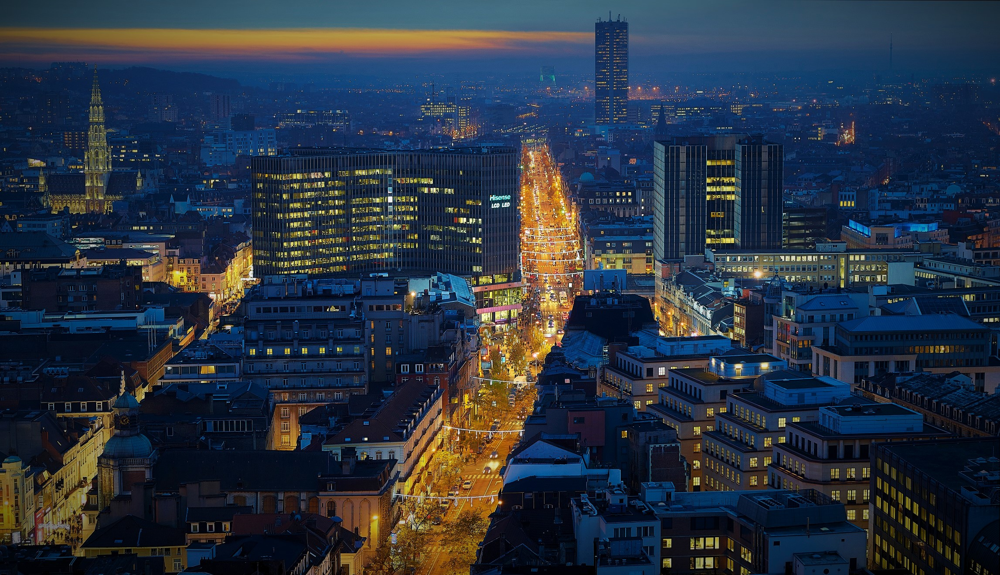
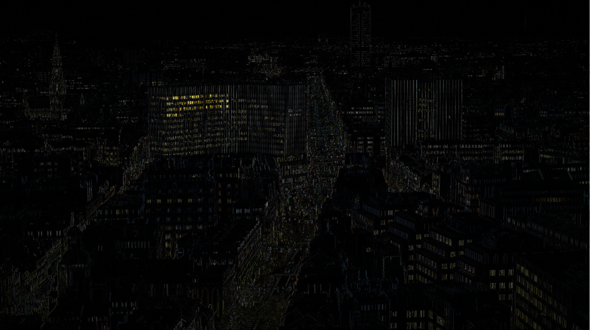

# Digital Brussels (Steganography)

### [-$ cd ..](../)

Here is the image that the creator of the challenge gave us. 


First we executed a binwalk command on the image to make sure there was nothing suspicious in the image. 

Here is the command and the result : 

> ``` sh
> binwalk Digital+Brussels.jpg
>
>   DECIMAL       HEXADECIMAL     DESCRIPTION
>   --------------------------------------------------------------------------------
> ```

As you can remark, the image did not contain anything at all.


Then we ran `exiftool` in the following way and we got the attached result:   
> ```sh
> exiftool Digital+Brussels.jpg
>
>   ExifTool Version Number         : 11.30
>   File Name                       : Digital+Brussels.jpg
>   Directory                       : .
>   File Size                       : 2.9 MB
>   File Modification Date/Time     : 2019:03:13 12:29:18+01:00
>   File Access Date/Time           : 2019:03:15 11:09:43+01:00
>   File Inode Change Date/Time     : 2019:03:15 10:34:48+01:00
>   File Permissions                : rw-r--r--
>   File Type                       : JPEG
>   File Type Extension             : jpg
>   MIME Type                       : image/jpeg
>   DCT Encode Version              : 100
>   APP14 Flags 0                   : [14]
>   APP14 Flags 1                   : (none)
>   Color Transform                 : YCbCr
>   Image Width                     : 2294
>   Image Height                    : 1320
>   Encoding Process                : Baseline DCT, Huffman coding
>   Bits Per Sample                 : 8
>   Color Components                : 3
>   Y Cb Cr Sub Sampling            : YCbCr4:4:4 (1 1)
>   Image Size                      : 2294x1320
>   Megapixels                      : 3.0
> ``` 

We also unsuccessfully tried to run a few well known steg tools. 

However, we remarked that it was the same image as the background of the CTF website so we decided to do a `diff` between both of them.
Here is the original picture of the website:


And here is the difference between the original one and the one we get in the challenge:


We clearly see a difference on the windows of the building. 
We assumed that the lights on meant 1s and the lights off meant 0s

We obtained this binary string:
011000110111001101100011011110110111100100110000011101010101111101010111001100010110111001111101

Then we launched a terminal and typed the following command: 
>```python
>hex(0b011000110111001101100011011110110111100100110000011101010101111101010111001100010110111001111101)[2:-1].decode("hex")
>   'csc{y0u_W1n}'
>```

