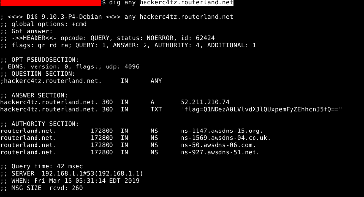

# Hackerc4tz 1, 2, 3, 4, 5 (Web)

### [-$ cd ..](../)

Author [BorelEnzo](https://borelenzo.github.io/CTFs/CSC_BE_2019/hacker_c4tz/)

This challenge was made of 5 parts, each one giving us a flag. Unfortunately, as we wrote this write-up the website was not reachable anymore ... We faced a really simple website with the following GIF:


and a message telling us that there was nothing interesting inside.

### 1st flag

We found our first flag in HTTP headers: **CSC{01-TastyHeaderForBreakfast}**. No real difficulty here, quite straightforward

### 2nd flag

The second flag was hidden somewhere in the js/jquery-3.3.1.min.js. Ctrl-F gave us: **CSC{02-SudoMakeMeAFlag}**

### 3rd flag

In the CSS file, we found a comment like this:

>TODO : Check CSS on port 443

On port 443 (HTTPS), the website was the same, except that we could download the certificate, giving us the third flag: **CSC{03-FourFourThreeIsKey}**

### 4th flag

CTF experience played a significant role here because this flag was not hidden in the website itself. At a moment, one of us had the good idea to check DNS records:



### 5th flag

There was an [obfuscated JS code](index.js) running on this website. Since we already found four flags, we supposed that the 5th one was hidden in the JS. But actually, there was no need to reverse it, and we wasted a lot of time.
By looking carefully, one could notice that the favicon was a flag:


We downloaded it and ran:

> ```sh
>$ binwalk favicon.ico 
>
>	DECIMAL       HEXADECIMAL     DESCRIPTION
>	--------------------------------------------------------------------------------
>	22            0x16            PNG image, 128 x 128, 8-bit/color RGBA, non-interlaced
>	103           0x67            Zlib compressed data, best compression
>	2063          0x80F           Zlib compressed data, default compression
>$ hexdump -C favicon.ico 
>	00000000  00 00 01 00 01 00 80 80  00 00 00 00 00 00 a2 08  |................|
>	00000010  00 00 16 00 00 00 89 50  4e 47 0d 0a 1a 0a 00 00  |.......PNG......|
>	00000020  00 0d 49 48 44 52 00 00  00 80 00 00 00 80 08 06  |..IHDR..........|
>	... snipped ...
>	000008a0  15 e9 da 34 a6 1a 3e ae  ab 40 74 62 fc 13 7f 00  |...4..>..@tb....|
>	000008b0  00 00 00 49 45 4e 44 ae  42 60 82                 |...IEND.B`.|
> ```

We extracted the PNG with `dd` and ran `zsteg` on the newly created image (an `exiftool` was actually sufficient...)


and got:

> ```sh
>$ zsteg icon.png 
>	meta Raw profile type APP1.. text: "\ngeneric profile\n     140\n4578696600004d4d002a0000000800030128000300000001000200000213000300000001\n000100008769000400000001000000320000000000049000000700000004303233319101\n00070000000401020300928600070000001e00000068a000000700000004303130300000\n000041534349490000004353437b30352d596f7541726541426f6c644f6e657d\n"
>	b1,rgba,msb,xy      .. text: ["w" repeated 57 times]
>	b1,abgr,lsb,xy      .. text: ["w" repeated 57 times]
>	b2,rgba,msb,xy      .. text: ["?" repeated 116 times]
>	b2,abgr,lsb,xy      .. text: ["?" repeated 116 times]
>	b3,rgba,msb,xy      .. file: MPEG ADTS, AAC, v4 Main, 22.05 kHz, surround + side
>	b4,rgba,lsb,xy      .. file: MPEG ADTS, AAC, v4 LTP, surround + side
> ```

We noticed the string **4353437b30352d596f7541726541426f6c644f6e657d** at the end of the extracted meta data, and once hex-decoded, we got: **CSC{05-YouAreABoldOne}**
